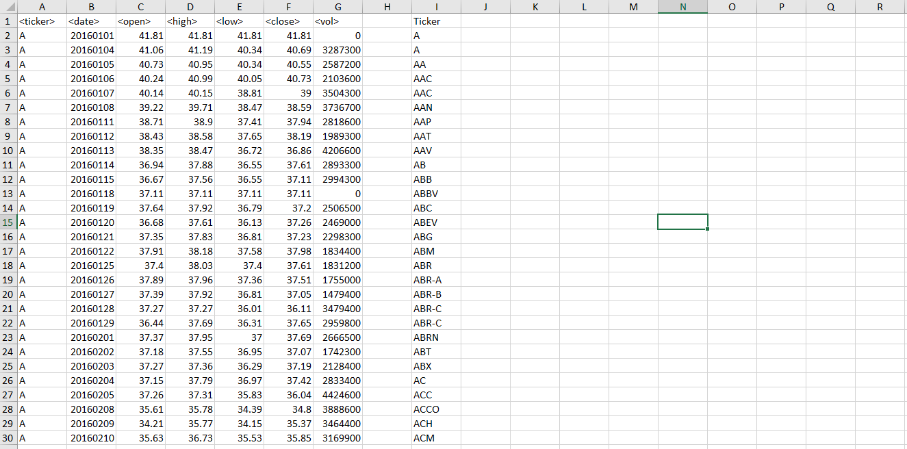

# VBA Challenge

This simple challenge was to create a VBA script that ran through stock changes throughout a year. This script needed to:

+ cycle through multiple sheets
+ apply conditional formatting to cells
+ calculate yearly change and total volume
+ create a summary table indentifying the stocks with the largest increase, decrease, and volume over the year

